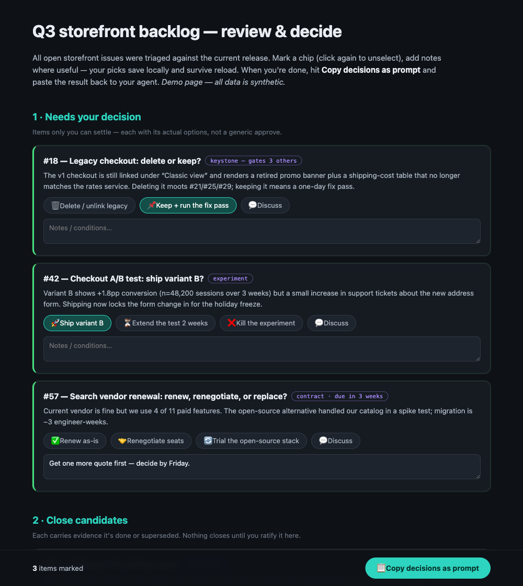
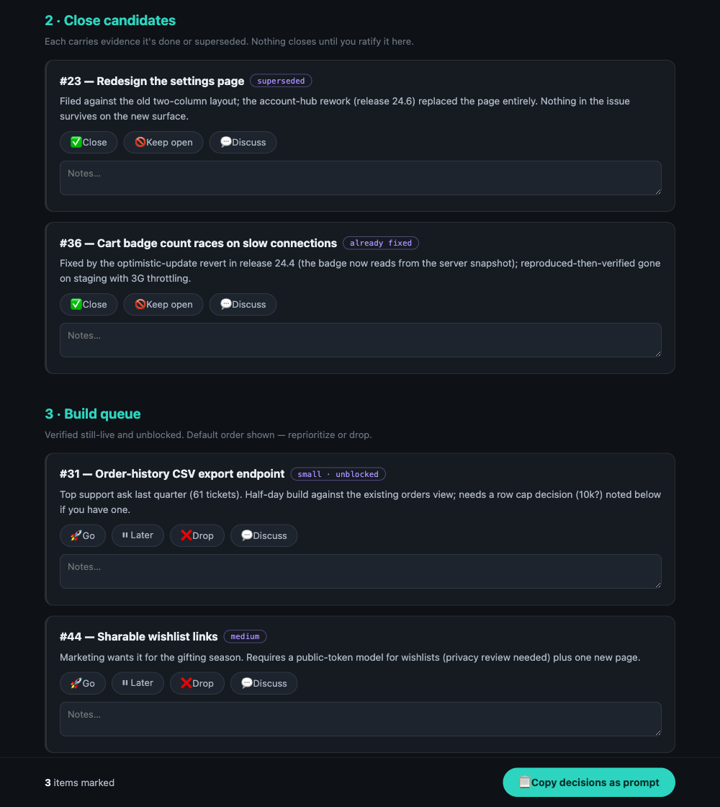

# interactive-feedback-report

A Claude Code skill that turns findings, plans, or backlog triages into a **single-file interactive HTML review page** — the reviewer clicks per-item decision chips, types notes in place, and copies everything back out as one structured prompt. No backend: it opens from `file://` or any static host, works offline, and survives reload via localStorage.

[](https://github.com/wan-huiyan/interactive-feedback-report/releases)
[](LICENSE)
[](https://github.com/wan-huiyan/interactive-feedback-report/commits)
[](https://github.com/wan-huiyan/interactive-feedback-report/actions/workflows/test.yml)
[](https://claude.com/claude-code)



*Demo page with synthetic data ([live HTML](docs/demo-review-page.html)). Decision items come first, each with its **actual options** ("Ship variant B" / "Extend the test") rather than a generic approve — so the copied prompt carries real decisions.*

## Quick Start

```
You: I triaged our 70 open issues — here's the report. Turn it into an HTML
     I can give feedback on, especially the ones that need my decision.

Claude: [invokes interactive-feedback-report]
        → builds review.html: decision items first (custom option chips),
          then ratifiable close-candidates, then the build queues
        → verifies chips/persistence/copy in a real browser
        → opens it for you

You: [click through, add notes, hit "Copy decisions as prompt", paste back]

Claude: [applies every decision — no retyping, no lost context]
```

The copied prompt looks like:

```
Feedback on the Q3 storefront backlog triage. Apply these decisions:

- [KEEP-FIX] #18 — Legacy checkout: delete or keep?
- [SHIP] #42 — Checkout A/B test: ship variant B?
- [note] #57 — Search vendor renewal — Get one more quote first, decide by Friday.

Read docs/backlog-triage.md for full context before acting.
```

## Installation

**Claude Code:**

```bash
# Plugin install (recommended)
/plugin marketplace add wan-huiyan/interactive-feedback-report
/plugin install interactive-feedback-report@wan-huiyan-interactive-feedback-report

# Git clone (always works)
git clone https://github.com/wan-huiyan/interactive-feedback-report.git ~/.claude/skills/interactive-feedback-report
```

**Cursor** (2.4+):

```bash
npx skills add wan-huiyan/interactive-feedback-report --global
# or clone into ~/.cursor/skills/
```

## What You Get

- **One self-contained `.html`** — inline CSS/JS, no build step, no server, no dependencies.
- **Per-item widgets** with single-select chips + a free-text note; answered items glow so progress is visible.
- **Question-specific options** where a real decision is needed (`data-opts` per item), generic approve/revise/hold/drop elsewhere.
- **localStorage persistence** — the reviewer can close the tab mid-review and resume later.
- **A copy-as-prompt dock** — one click collects every marked item into a structured, cold-startable prompt (with clipboard-API *and* `execCommand` fallbacks).
- **A browser-based verification recipe** — chip persistence across reload, deselect behavior, prompt construction, overflow geometry — so the page ships tested, not hoped-for.



## Typical Ad-Hoc vs With This Skill

| | Flat report + chat feedback | interactive-feedback-report |
|---|---|---|
| Reviewer effort | Re-type each decision into chat, from memory | Click a chip, optionally add a note |
| Decision fidelity | "Approve the third one… no, the other third one" | Stable item ids; options are the item's real choices |
| Interruptions | Feedback lost if the chat/tab resets | Picks persist in localStorage |
| Handback | Free-text the agent must re-parse | One structured prompt, cold-startable |
| Infrastructure | — | None (single file, `file://`-safe) |

## How It Works

| Step | What happens |
|---|---|
| 1 | Items are rendered as `.fb` widgets: stable `data-id`, human `data-q` title, optional `data-opts` decision chips |
| 2 | One JS injector builds every chip row (consistency; adding an option is a one-line change) |
| 3 | Selections/notes save to a **versioned** localStorage key; empty records are pruned; reload restores |
| 4 | The fixed dock's `buildPrompt()` emits `- [DECISION] title — note` lines plus a cold-start instruction line |
| 5 | Copy uses `clipboard.writeText(t).then(ok, fallback)` — the fallback chain matters (see Design Decisions) |
| 6 | The page is verified in a real browser via DOM evaluation before it ships |

## Key Design Decisions

- **`writeText(t).then(ok, fallback)`, never `try/catch`** — a blocked clipboard (iframe without `allow="clipboard-write"`, headless) returns a *rejected Promise*, not a sync throw. The `try/catch` version shows "Copied ✓" while copying nothing, and it only breaks in the embedded context, so local testing passes.
- **Decision items get their real options.** A generic "approve" chip on "delete or keep the legacy page?" loses the answer. `data-opts` per item keeps the copied prompt decision-bearing (`[KEEP-FIX]`, `[SHIP]`).
- **The copied prompt must cold-start the recipient.** For your own next agent session, append "read `<paths>` for context". For a client recipient, drop internal paths and say "paste this into your reply" — decide the audience before writing the copy string.
- **Versioned, low-entropy storage keys** (`myreport_feedback_v1`) — versioning prevents schema collisions with old saved input; low entropy avoids tripping CI secret scanners (gitleaks' generic-api-key rule flags high-entropy strings).
- **Addendum mode for live pages** — if the reviewer may already be ticking a shipped page, only ever *add* widgets with new ids; never rename existing `data-id`/`data-q` (ids key the store, titles feed the prompt).

## Limitations

- **No aggregation across reviewers** — localStorage is per browser profile. Two reviewers means two copied prompts to merge (or graduate to a backend endpoint; the skill notes the upgrade path).
- **Not a form service** — no validation, no auth, no server-side record. The durable artifact is the copied prompt, not the page state.
- **localStorage is origin-scoped** — moving the file to a different host/origin orphans earlier picks (they're not lost, just not visible from the new origin).
- **Clipboard inside iframes needs the parent's cooperation** (`allow="clipboard-write"`); the fallback keeps the feature working but with an extra prompt dialog in the worst case.

## Dependencies

None at runtime — vanilla HTML/CSS/JS in one file. For the verification step, any browser-automation MCP (e.g. Playwright) plus `python3 -m http.server`; without them, verify manually in a browser.

<details>
<summary><b>Quality checklist</b> — what a page built with this skill guarantees</summary>

- [ ] Chips + notes persist across reload (versioned localStorage key)
- [ ] Clicking the active chip deselects; empty records are pruned from the store
- [ ] `#fbCount` reflects the store; answered widgets are visually marked
- [ ] `buildPrompt()` emits every marked item as `- [DECISION] title — note`
- [ ] Copy works via clipboard API *and* falls back to `execCommand` / `prompt()`
- [ ] No horizontal overflow; dock pinned to the viewport bottom
- [ ] Test entries removed from localStorage before handoff (reviewer starts blank)
- [ ] All demo/example data is synthetic
</details>

## Related Skills

- [skill-anonymizer](https://github.com/wan-huiyan/skill-anonymizer) — the client-data audit used before publishing this skill
- [data-provenance-verifier](https://github.com/wan-huiyan/data-provenance-verifier) — provenance checks for skills that ship datasets

## Version History

- **1.1.0** (2026-07-17) — First full owner round-trip confirmed in production; new guidance: define tick SEMANTICS ("Meaning of ticks" legend in `buildPrompt()` + a `.meaning` line on the widget) whenever a chip means "adopt the recommendation" — a bare [APPROVE] on a recommendation-shaped question is ambiguous to the receiving session.
- **1.0.0** (2026-07-16) — Initial public release: widget/state/dock pattern, question-specific decision chips, clipboard fallback chain, addendum mode, browser verification recipe, synthetic demo page + screenshots.

## License

MIT — see [LICENSE](LICENSE). All examples and screenshots use synthetic data.
